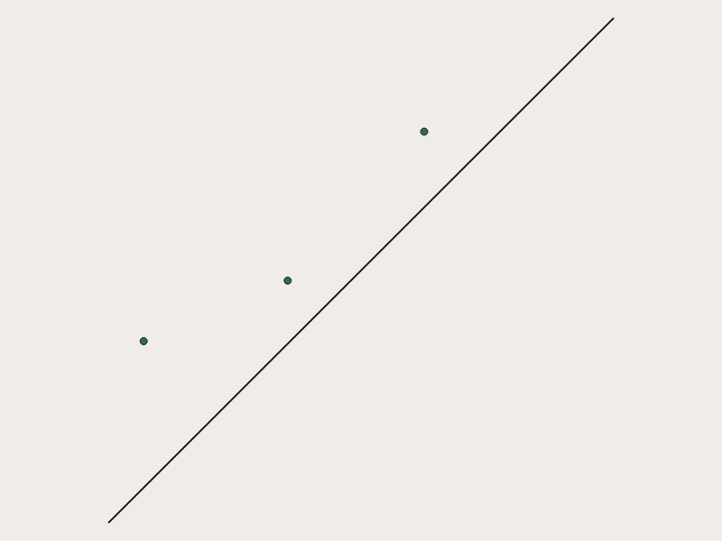
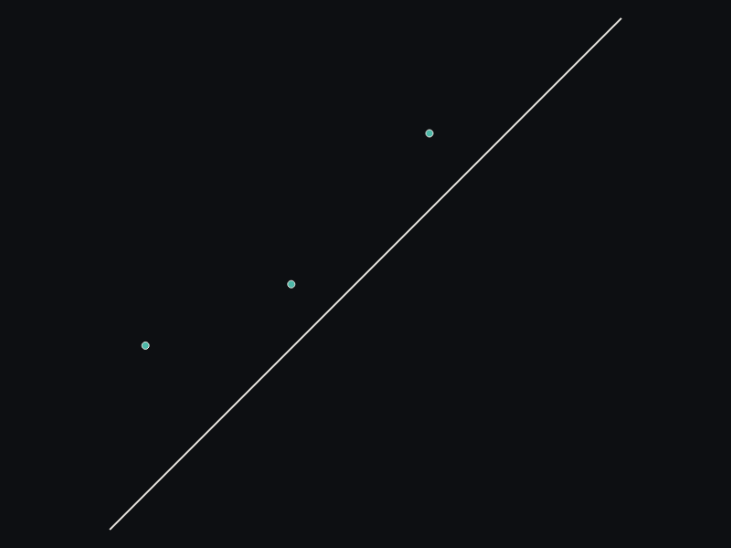
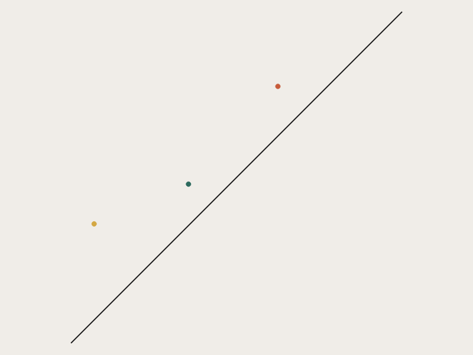
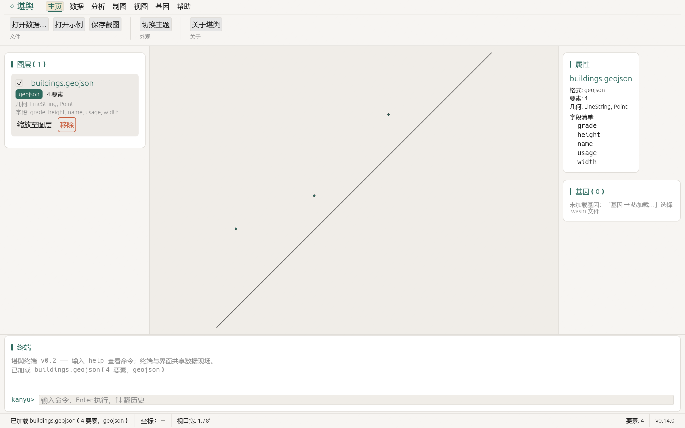
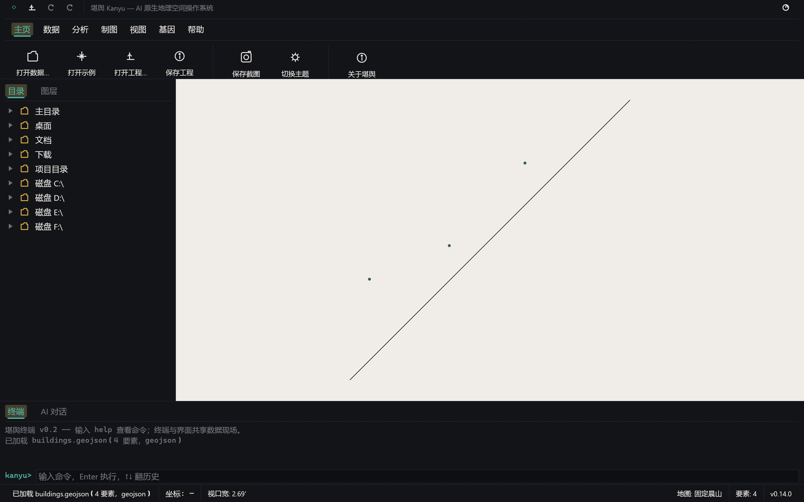

# 堪舆 Kanyu —— AI 原生地理空间操作系统

<p align="center">
  
</p>

> **以天地为盘，以数据为爻，以 AI 为神，重构地理空间之道。**

[](https://github.com/DaoMingyuan/Kanyu/actions/workflows/ci.yml)
[](LICENSE-MIT)
[](rust-toolchain.toml)
[](docs/MCP.md)

**English**: Kanyu (堪舆) is an AI-native geospatial operating system written in Rust. It unifies
geospatial data in a zero-copy memory model, exposes **every kernel capability as standard
[MCP](https://modelcontextprotocol.io) tools** (no `execute_code`, fully auditable), and treats
each project's `AGENTS.md` as the semantic compass for AI agents. This repository contains the
kernel (`kanyu-core`), the CLI (`kanyu`), and the MCP server (`kanyu-mcp`). GPU rendering,
vector editing, and the WASM gene system are on the [roadmap](#路线图-roadmap).
See [docs/MASTERPLAN.md](docs/MASTERPLAN.md) for the full vision.

---

## 为什么再造一个 GIS？

| | 传统 GIS（QGIS 系） | 现有 GIS MCP（Python 薄壳） | **堪舆** |
|---|---|---|---|
| 内核 | C++/GDAL 依赖地狱 | Python + GIL | **纯 Rust，零 C 依赖内核** |
| AI 接入 | 外挂插件 | WKT 字符串进出 | **一等公民 MCP，结构化 JSON + CRS/单位元数据** |
| 执行模型 | — | `execute_code` 任意代码执行（安全隐患） | **声明式工具，沙箱化，可审计** |
| 项目语义 | 无 | 无 | **AGENTS.md 地理 profile（图层/CRS/业务规则）** |
| 内存模型 | 逐要素 | 逐要素 | **堪舆数据库（GeoArrow 兼容）列式零拷贝 ✅** |
| 自我迭代 | 无 | 无 | **观察→诊断→编码→验证→部署→回溯闭环** |

## 特性（v0.1.0）

- **数据心脏**：统一格式注册表（18 种格式的能力矩阵），GeoJSON 原生加载与属性查询。
- **堪舆数据库**：自研存档 `.kdb`（Arrow IPC + `kanyu.*` 元数据，与内存模型同构、类型保真、任何 Arrow 工具链可读）与堪舆工程 `.kyu`（JSON 工程清单：图层引用/视口/地图色彩/可见性），全格式互转。
- **脊髓 CLI**：`kanyu data info/load/query/export`、`kanyu introspect`、`kanyu agents init/validate`、`kanyu mcp serve`，全局 `--json`。
- **神经接口**：基于官方 `rmcp` SDK 的 MCP Server（stdio + streamable HTTP），确定性工具，结构化输出。
- **离屏渲染**：`kanyu render map` / MCP `kanyu_render_map`——数据 → PNG（tiny-skia）/ SVG 地图图片，晨山/夜观星双主题，AI 代理可直接"看见"数据。
- **桌面壳层**：`kanyu-shell`——ArcGIS Pro 三段式功能区（QAT 快速访问栏 + 七页签 + 图标大按钮组）、QGIS 式目录浏览器树与图层工具栏、独立终端 + AI 对话双页签（本地规则/OpenAI 兼容双驱动）、Apple HIG 字体间距体系（Segoe UI + 发丝线分隔）、地图色彩与界面主题解耦（固定晨山保制图正确）、`.kyu` 工程打开/保存、内置 `ui_kit` 设计系统，晨山/夜观星双主题。
- **技能热加载**：MCP `kanyu_system_hotload` / `kanyu_skill_run` / `kanyu_skill_list`——WASM 技能（wasmtime 沙箱）远程加载校验与执行，AI 代理可远程扩展内核能力。
- **项目罗盘**：`AGENTS.md` 地理 profile 的生成、解析与完整性校验。

## 渲染效果（自家管线实拍）

`kanyu render map examples/buildings.geojson --out map.png` —— 晨山（左）/ 夜观星（中）/ 按 height 分级设色（右）：

<p align="center">
  
  
  
</p>

桌面壳层 `kanyu-shell`（晨山 / 夜观星）：

<p align="center">
  
  
</p>

## 快速开始

### 安装（Windows）

- **桌面端 MSI**：从 [Releases](https://github.com/DaoMingyuan/Kanyu/releases) 下载
  `kanyu-<版本>-x86_64.msi`——用户级安装（免 UAC），含 GUI 壳层 + CLI + MCP，
  自动创建桌面「堪舆」快捷方式与开始菜单项。
- 或使用三平台 CLI 压缩包（`kanyu` 命令行，免安装解压即用）。

### 从源码构建

```bash
# 构建（需要 Rust 1.94+）
cargo build --release

# 检视数据
./target/release/kanyu data info examples/buildings.geojson

# 属性查询（AI 代理加 --json）
./target/release/kanyu data query examples/buildings.geojson --filter "height > 50" --json

# 系统自省 —— AI 读取自身
./target/release/kanyu introspect

# 为你的项目生成语义罗盘
./target/release/kanyu agents init --project ./my_project --crs EPSG:4526
./target/release/kanyu agents validate --path ./my_project/AGENTS.md
```

### 接入 AI 代理（MCP）

任何 MCP 兼容客户端（Claude Desktop、Codex、Kimi 等）加入以下配置：

```json
{
  "mcpServers": {
    "kanyu": {
      "command": "kanyu",
      "args": ["mcp", "serve", "--transport", "stdio"]
    }
  }
}
```

之后即可用自然语言驱动："*加载 buildings.geojson，找出所有高于 50 米的建筑并导出*"。

远程接入（streamable HTTP）：

```bash
kanyu mcp serve --transport http --port 3000
# 客户端将 URL 指向 http://127.0.0.1:3000/mcp
# ⚠️ 无鉴权/TLS，远程暴露请自行加反向代理与鉴权
```

## 架构总览

```
┌─────────────────────────────────────────────────────┐
│  Meta-Level   堪舆灵：意图理解 / 空间推理 / 代码生成   │
├─────────────────────────────────────────────────────┤
│  Interface    kanyu-mcp —— MCP 神经接口（rmcp 3.x）  │
├─────────────────────────────────────────────────────┤
│  Object-Level 堪舆内核                                │
│  ├─ kanyu-core   数据心脏（格式矩阵/图层/AGENTS.md）  │
│  ├─ kanyu-cli    脊髓（kanyu 命令行）                │
│  ├─ kanyu-render 眼睛（离屏渲染 tiny-skia+SVG）🚧     │
│  ├─ kanyu-edit   手（DCEL 拓扑编辑）    [planned]    │
│  ├─ kanyu-skill   技能（wasmtime 插件宿主）🚧         │
│  └─ kanyu-shell  壳层（egui 桌面 UI）   [incubating] │
└─────────────────────────────────────────────────────┘
```

详细架构见 [docs/ARCHITECTURE.md](docs/ARCHITECTURE.md)；接口文档：
[API](docs/API.md) · [SDK](docs/SDK.md) · [MCP](docs/MCP.md) · [CLI](docs/CLI.md)。

## 仓库结构

```
├── crates/
│   ├── kanyu-core/    # 内核：格式注册表、图层模型、AGENTS.md 语义、系统自省
│   ├── kanyu-cli/     # kanyu 命令行（clap）
│   └── kanyu-mcp/     # MCP Server（rmcp，stdio）
├── docs/              # 总规、架构、API/SDK/MCP/CLI 文档
├── examples/          # 示例数据
└── tests/             # 集成测试
```

## 路线图 (Roadmap)

| 阶段 | 目标 | 状态 |
|------|------|------|
| Phase 1 地基 | 纯 Rust 内核：GeoArrow 内存模型、FGB/GeoParquet/Shapefile/DXF/DWG(读) 原生 I/O | 🚧 进行中 |
| Phase 2 视界 | wgpu GPU 渲染管线，GeoArrow→SSBO 直通，MLT 瓦片 | 📋 规划 |
| Phase 3 手 | DCEL 增量拓扑编辑，Undo/Redo，属性表 | 📋 规划 |
| Phase 4 脑 | LLM 融合、MCP tasks 长任务、代码生成→WASM 沙箱流水线 | 📋 规划 |
| Phase 5 魂 | A/B 测试框架、技能市场、知识库 RAG、自我迭代闭环 | 📋 规划 |

完整计划与技术选型裁决（为什么用 wgpu 而不是 bgfx、为什么 GDAL 降为插件、
DWG 为什么走 acadrust + 补丁层）见 [docs/MASTERPLAN.md](docs/MASTERPLAN.md)。

## 贡献

欢迎贡献！请阅读 [CONTRIBUTING.md](CONTRIBUTING.md)。安全相关问题请见 [SECURITY.md](SECURITY.md)。

## 许可证

双许可：[MIT](LICENSE-MIT) **或** [Apache-2.0](LICENSE-APACHE)，与 Rust 地理生态
（geo、geoarrow、arrow、rmcp）完全兼容。任选其一使用。

---

> *"天行健，君子以自强不息。"*
> 堪舆以 GeoArrow 为血液，以 GPU 为眼，以 AI 为魂，以 WASM 为技能。
